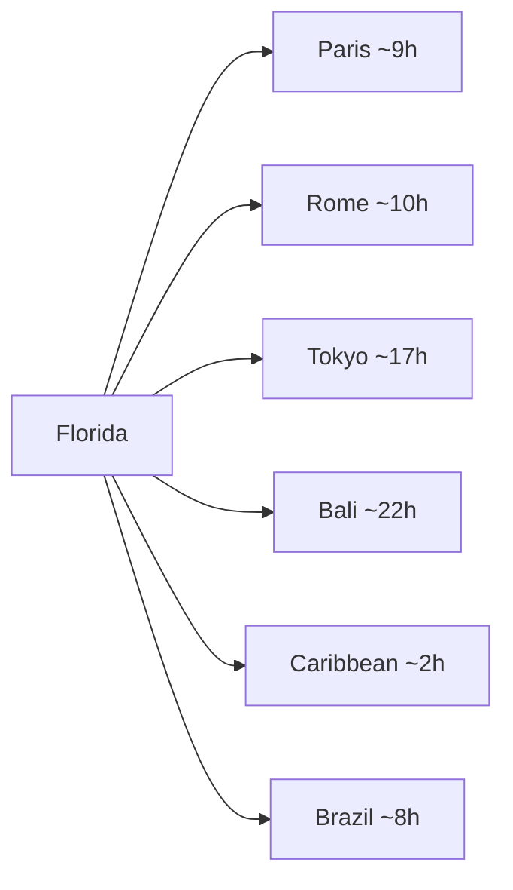
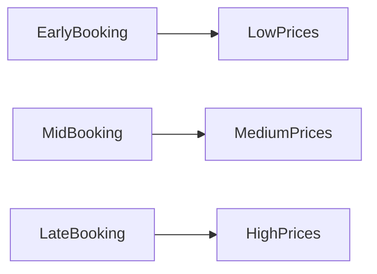

# 🌍 Ultimate Travel & Lifestyle Planning Hub

A fully interactive, data-driven travel & lifestyle dashboard designed for fast decision-making, price comparison, and planning efficiency.

---

## 🧭 Navigation Tabs

- [🌎 Worldwide Travel](#-worldwide-travel)
- [🌴 Florida Travel](#-florida-travel)
- [🇺🇸 USA Travel](#-usa-travel)
- [🚢 Cruises from South Florida](#-cruises-from-south-florida)
- [🎉 Holiday Long Weekend Travel](#-holiday-long-weekend-travel)
- [🍱 Meal Planning (No Cooking Strategy)](#-meal-planning-no-cooking-strategy)

---

# 🌎 Worldwide Travel

## 🌍 Overview

Global travel from Florida offers diverse experiences but varies significantly in cost, travel time, and logistics.

<picture>
	<source media="(prefers-color-scheme: dark)" srcset="https://images.unsplash.com/photo-1502920917128-1aa500764cbd?auto=format&fit=crop&w=1600&q=80&sat=-100&exp=-40#gh-dark-mode-only">
	<source media="(prefers-color-scheme: light)" srcset="https://images.unsplash.com/photo-1502920917128-1aa500764cbd?auto=format&fit=crop&w=1600&q=80#gh-light-mode-only">
	
</picture>

---

## ✈️ Travel Time Comparison

---

## 💰 Cost Comparison by Region

| Region     | Flight ($) | Hotel/Night ($) | Total 5-Day Budget |
| ---------- | ---------- | --------------- | ------------------ |
| Europe     | 600–1200   | 150–400         | 1500–3500          |
| Asia       | 900–1800   | 80–300          | 1800–4000          |
| Caribbean  | 200–600    | 120–350         | 900–2500           |
| S. America | 400–900    | 70–250          | 1200–2800          |

---

## 🌟 Top Destinations

### 🇫🇷 Paris

<picture>
	<source media="(prefers-color-scheme: dark)" srcset="https://images.unsplash.com/photo-1499856871958-5b9627545d1a?auto=format&fit=crop&w=1600&q=80&sat=-100&exp=-40#gh-dark-mode-only">
	<source media="(prefers-color-scheme: light)" srcset="https://images.unsplash.com/photo-1499856871958-5b9627545d1a?auto=format&fit=crop&w=1600&q=80#gh-light-mode-only">
	
</picture>

- 🔗 [https://en.parisinfo.com/](https://en.parisinfo.com/)
- ⭐ Rating: 9/10
- ✔️ Best for: Couples, luxury
- ❌ Expensive dining

### 🇯🇵 Tokyo

<picture>
	<source media="(prefers-color-scheme: dark)" srcset="https://images.unsplash.com/photo-1505060890934-08b3cfead48d?auto=format&fit=crop&w=1600&q=80&sat=-100&exp=-40#gh-dark-mode-only">
	<source media="(prefers-color-scheme: light)" srcset="https://images.unsplash.com/photo-1505060890934-08b3cfead48d?auto=format&fit=crop&w=1600&q=80#gh-light-mode-only">
	
</picture>

- 🔗 [https://www.gotokyo.org/en/](https://www.gotokyo.org/en/)
- ⭐ Rating: 9.5/10
- ✔️ Culture, food
- ❌ Long flight

---

## 🧳 Sample 5-Day Itinerary (Europe)

- Day 1: Arrival + city walk
- Day 2: Museums + landmarks
- Day 3: Food tour
- Day 4: Day trip
- Day 5: Shopping + departure

---

## ⚖️ Decision Matrix

| Option    | Cost     | Experience | Convenience |
| --------- | -------- | ---------- | ----------- |
| Europe    | ⭐⭐⭐   | ⭐⭐⭐⭐⭐ | ⭐⭐⭐      |
| Caribbean | ⭐⭐⭐⭐ | ⭐⭐⭐⭐   | ⭐⭐⭐⭐⭐  |

---

## 🧠 Quick Picks

- 💸 Budget: Caribbean
- 💎 Luxury: Paris
- ⚡ Short trip: Bahamas

---

# 🌴 Florida Travel

## 🌴 Overview

Perfect for quick, low-cost, high-value trips from South Florida.

<picture>
	<source media="(prefers-color-scheme: dark)" srcset="https://images.unsplash.com/photo-1507525428034-b723cf961d3e?auto=format&fit=crop&w=1600&q=80&sat=-100&exp=-40#gh-dark-mode-only">
	<source media="(prefers-color-scheme: light)" srcset="https://images.unsplash.com/photo-1507525428034-b723cf961d3e?auto=format&fit=crop&w=1600&q=80#gh-light-mode-only">
	
</picture>

---

## 🚗 Driving Distances

| Destination | Distance | Time   |
| ----------- | -------- | ------ |
| Miami       | 30 mi    | 45 min |
| Orlando     | 230 mi   | 3.5 hr |
| Key West    | 190 mi   | 4 hr   |
| Tampa       | 270 mi   | 4 hr   |

---

## 🏝️ Top Destinations

### Miami

- 🔗 [https://www.miamiandbeaches.com/](https://www.miamiandbeaches.com/)
- ⭐ 9/10
- ✔️ Nightlife
- ❌ Expensive

### Key West

<picture>
	<source media="(prefers-color-scheme: dark)" srcset="https://images.unsplash.com/photo-1507525428034-b723cf961d3e?auto=format&fit=crop&w=1600&q=80&sat=-100&exp=-40#gh-dark-mode-only">
	<source media="(prefers-color-scheme: light)" srcset="https://images.unsplash.com/photo-1507525428034-b723cf961d3e?auto=format&fit=crop&w=1600&q=80#gh-light-mode-only">
	
</picture>

- 🔗 [https://fla-keys.com/](https://fla-keys.com/)
- ⭐ 9.2/10
- ✔️ Scenic drive
- ❌ Long drive

---

## 🏨 Hotel vs Airbnb

| Type   | Avg Price | Pros      | Cons          |
| ------ | --------- | --------- | ------------- |
| Hotel  | $150–300  | Amenities | Cost          |
| Airbnb | $120–250  | Space     | Cleaning fees |

---

## 🧠 Quick Picks

- Weekend: Miami
- Relaxation: Naples
- Adventure: Key West

---

# 🇺🇸 USA Travel

## 🗺️ Overview

Best mix of culture, entertainment, and convenience.

<picture>
	<source media="(prefers-color-scheme: dark)" srcset="https://images.unsplash.com/photo-1494526585095-c41746248156?auto=format&fit=crop&w=1600&q=80&sat=-100&exp=-40#gh-dark-mode-only">
	<source media="(prefers-color-scheme: light)" srcset="https://images.unsplash.com/photo-1494526585095-c41746248156?auto=format&fit=crop&w=1600&q=80#gh-light-mode-only">
	
</picture>

---

## ✈️ Flight + Hotel Bundles

| Destination | Flight   | Hotel | Total |
| ----------- | -------- | ----- | ----- |
| NYC         | $200–400 | $250  | $1200 |
| Vegas       | $250–500 | $200  | $1300 |
| LA          | $300–600 | $250  | $1500 |

---

## 🗓️ Best Seasons

- NYC: Spring/Fall
- Vegas: Winter
- National Parks: Summer

---

## 🧠 Quick Picks

- Party: Vegas
- Culture: NYC
- Nature: National Parks

---

# 🚢 Cruises from South Florida

## 🚢 Overview

Best value per dollar for all-inclusive travel.

<picture>
	<source media="(prefers-color-scheme: dark)" srcset="https://images.unsplash.com/photo-1507525428034-b723cf961d3e?auto=format&fit=crop&w=1600&q=80&sat=-100&exp=-40#gh-dark-mode-only">
	<source media="(prefers-color-scheme: light)" srcset="https://images.unsplash.com/photo-1507525428034-b723cf961d3e?auto=format&fit=crop&w=1600&q=80#gh-light-mode-only">
	
</picture>

---

## ⚓ Cruise Comparison

| Cruise Line     | Price     | Rating | Duration | Port          |
| --------------- | --------- | ------ | -------- | ------------- |
| Royal Caribbean | $400–900  | ⭐9    | 3–4 days | Miami         |
| Carnival        | $300–700  | ⭐8    | 3–4 days | Miami         |
| Norwegian       | $450–1000 | ⭐9    | 3–4 days | Ft Lauderdale |

---

## 🌴 Destinations

- Bahamas
- Cozumel
- Caribbean Islands

---

## 💡 Tips

- Book 60–90 days ahead
- Balcony rooms add ~30–50%

---

## 🧠 Quick Picks

- Budget: Carnival
- Luxury: Norwegian
- Best overall: Royal Caribbean

---

# 🎉 Holiday Long Weekend Travel

## 🎉 Overview

Maximize PTO with strategic planning.

---

## 📈 Price Trend Graph

---

## 📅 Best Trips

| Holiday      | Destination | Price |
| ------------ | ----------- | ----- |
| Memorial Day | Bahamas     | $500  |
| July 4th     | Miami       | $600  |
| Labor Day    | NYC         | $800  |

---

## 🧠 Strategy

- Book 2–3 months early
- Avoid peak flight times

---

# 🍱 Meal Planning (No Cooking Strategy)

## 🍱 Overview

Save money and time with bulk meal strategies.

<picture>
	<source media="(prefers-color-scheme: dark)" srcset="https://images.unsplash.com/photo-1504674900247-0877df9cc836?auto=format&fit=crop&w=1600&q=80&sat=-100&exp=-40#gh-dark-mode-only">
	<source media="(prefers-color-scheme: light)" srcset="https://images.unsplash.com/photo-1504674900247-0877df9cc836?auto=format&fit=crop&w=1600&q=80#gh-light-mode-only">
	
</picture>

---

## 🛒 Options

| Store       | Price | Servings | Cost/Meal | Type    |
| ----------- | ----- | -------- | --------- | ------- |
| Whole Foods | $35   | 4–5      | $7        | Healthy |
| Costco      | $25   | 5–6      | $5        | Bulk    |
| Publix      | $40   | 4–6      | $6–8      | Variety |

---

## ⚖️ Cost vs Eating Out

| Option     | Cost/Meal |
| ---------- | --------- |
| Eating Out | $15–25    |
| Platters   | $5–8      |

---

## 🧠 Tips

- Store in airtight containers
- Mix proteins for variety

---

## 🧠 Quick Picks

- Best value: Costco
- Best quality: Whole Foods
- Best variety: Publix

---

# 🎯 FINAL DECISION TOOL

## 🏆 Best Choices

| Goal            | Best Option  |
| --------------- | ------------ |
| Cheapest Travel | Florida      |
| Best Experience | Europe       |
| Quick Escape    | Cruise       |
| No Cooking      | Costco Meals |

---

✅ You now have a **complete planning system** to:

- Compare costs instantly
- Choose trips quickly
- Optimize budget and time
